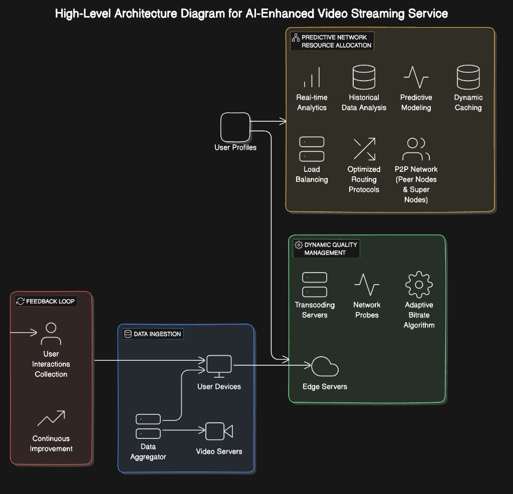
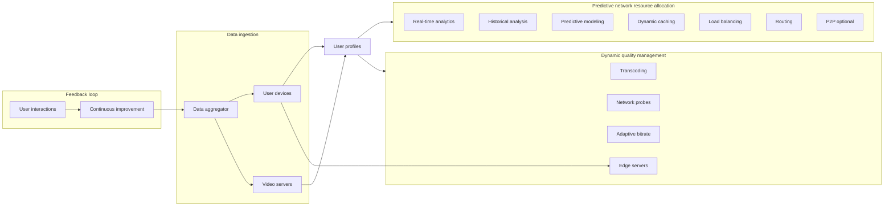

# AI-Enhanced Video Streaming and Recommendation System

A **control-plane API** for AI-assisted streaming: adaptive bitrate (ABR) decisions, network forecasting, edge-aware delivery, recommendations, content analysis, unified telemetry ingest, privacy controls, and batch export for offline training.

**Stack:** FastAPI · PostgreSQL · Prometheus · Grafana · PyTorch / scikit-learn (optional ML paths in Docker image)

---

## Contents

- [High-level architecture](#high-level-architecture)
- [Repository layout](#repository-layout)
- [Quick start](#quick-start)
- [Configuration](#configuration)
- [API overview](#api-overview)
- [Feature reference](#feature-reference)
- [Workflows](#workflows)
- [Ethics & responsible use](#ethics--responsible-use)
- [Operational scale & latency](#operational-scale--latency)
- [Production notes](#production-notes)
- [License](#license)

---

## High-level architecture





### Diagram → repository

| Block | Primary APIs & assets |
|--------|------------------------|
| **Feedback loop** | `/feedback/interaction`, `/quality/feedback`, `/models/metrics`, `/ethics/fairness-report`, `/analytics/export/training`, `/analytics/feedback/summary` |
| **Data ingestion** | `/ingest/event`, `/ingest/batch`, `/network/probe`, `ingestion_events` |
| **User profiles** | `/users/{id}/preferences`, `/privacy/consent`, `/viewing/event`, `/recommendations/{user_id}` |
| **Predictive allocation** | `/network/forecast`, `/metrics`, `/delivery/optimize`, `configs/nginx*.conf`, `configs/haproxy.example.cfg` |
| **Dynamic quality** | `/quality/recommend`, `/delivery/optimize`, `/edges/register`, `scripts/transcode_abr.sh` |

---

## Repository layout

| Path | Role |
|------|------|
| `backend/` | FastAPI app (`app/main.py`), SQLAlchemy models, ABR / ML / privacy services; `Dockerfile`; `requirements.txt` + `requirements-analysis.txt` |
| `configs/` | NGINX cache, HAProxy LB, microservices LB example |
| `docs/` | High-level architecture PNG |
| `observability/` | Prometheus scrape config, Grafana provisioning |
| `scripts/` | Multi-rung HLS transcoding; Spark NDJSON reader example |
| `docker-compose.yml` | Postgres, backend, Prometheus, Grafana |

---

## Quick start

```bash
docker compose up --build
```

| Service | URL |
|---------|-----|
| OpenAPI / Swagger | http://localhost:8000/docs |
| Prometheus | http://localhost:9090 |
| Grafana | http://localhost:3000 (default `admin` / `admin`) |

Scale API replicas: `docker compose up --scale backend=3` (place an LB in front; see `configs/nginx-microservices.example.conf`).

---

## Configuration

Set via environment (e.g. in `docker-compose.yml` or `.env`):

| Variable | Purpose |
|----------|---------|
| `DATABASE_URL` | Async SQLAlchemy URL (default: Postgres in compose) |
| `PRIVACY_POLICY_VERSION` | Shown on `GET /privacy/transparency` |
| `PRIVACY_POLICY_URL` | Public policy link |
| `DATA_PROTECTION_CONTACT` | DPO / privacy contact string |

Use **TLS** at the reverse proxy and **encrypted storage** for Postgres in production. See transparency endpoint for encryption and compliance notes.

---

## API overview

Grouped by concern (all JSON unless noted):

| Area | Methods | Paths (representative) |
|------|---------|-------------------------|
| Health & metrics | GET | `/health`, `/metrics` |
| User prefs | PUT, GET | `/users/{user_id}/preferences` |
| Privacy & GDPR-style | GET, PUT, GET, GET, POST | `/privacy/transparency`, `/privacy/consent`, `/privacy/consent/{user_id}`, `/privacy/export/{user_id}`, `/privacy/erasure` |
| Network | POST, POST | `/network/probe`, `/network/forecast` |
| ABR & delivery | POST | `/quality/recommend`, `/delivery/optimize` |
| Quality RL feedback | POST | `/quality/feedback` |
| Ingestion | POST | `/ingest/event`, `/ingest/batch` |
| Edges | POST | `/edges/register` |
| Viewing & recommend | POST, GET | `/viewing/event`, `/recommendations/{user_id}` |
| Feedback & analytics | POST, GET, GET | `/feedback/interaction`, `/analytics/feedback/summary`, `/analytics/export/training` |
| Content analysis | POST | `/content/analyze` (multipart) |
| Models & ethics | POST, GET, POST, GET | `/models/metrics`, `/ethics/fairness-report`, `/ethics/fairness-reports` |

---

## Feature reference

| Concept | Implementation |
|--------|----------------|
| Network monitoring | `POST /network/probe` → `network_samples`; Prometheus scrapes `/metrics`; Grafana in compose |
| SNMP / gear metrics | Use `snmp_exporter` + Prometheus; forward summaries into `/network/probe` or ingest `event_type: network_probe` |
| Viewer preferences | Postgres `user_preferences` via `/users/{id}/preferences` |
| ABR / RL | Tabular Q-learning in `backend/app/services/quality_rl.py`; `fast_path` skips forecast + exploration |
| Ladder / packaging | `POST /quality/recommend`; align with `scripts/transcode_abr.sh` and `quality_rl.LADDER` |
| Forecasting | `POST /network/forecast` (trend baseline; swap for LSTM/ARIMA + Spark) |
| CDN / LB examples | `configs/nginx.example.conf`, `configs/haproxy.example.cfg` |
| P2P / SD-WAN | Not bundled; metrics and delivery hints support your edge / routing stack |
| Content analysis | `POST /content/analyze` — CNN (ResNet-18), GRU transitions, TF–IDF themes (`requirements-analysis.txt`, ffmpeg in image) |
| Recommendations | TruncatedSVD + PyTorch MLP hybrid; `GET /recommendations/{user_id}` |
| Integration | Ingest hooks mirror probes and edge load; `/delivery/optimize` combines ABR + edge + hints |

---

## Workflows

1. **ABR session:** set preferences → emit probes → `POST /quality/recommend` (or `/delivery/optimize` with edges registered) → player switches ladder → `POST /quality/feedback` (requires personalization consent if enforced).
2. **Recommendations:** `POST /viewing/event` (and optional ratings) → `GET /recommendations/{user_id}`.
3. **Central ingest:** agents `POST /ingest/event` or `/ingest/batch` (`video_server` | `user_device` | `edge` | `infra`); `network_probe` events can populate the same history as `/network/probe`.
4. **Batch training:** `GET /analytics/export/training` (NDJSON) → Spark / cloud jobs; respect user `consent_model_training` / `consent_analytics` in export.
5. **Privacy:** `GET /privacy/transparency` → user accepts via `PUT /privacy/consent` → optional `GET /privacy/export/{user_id}` or `POST /privacy/erasure` with `confirm: true`.

### FFmpeg multi-bitrate (HLS)

```bash
chmod +x scripts/transcode_abr.sh
./scripts/transcode_abr.sh /path/to/source.mp4 ./media/out
```

---

## Ethics & responsible use

| Topic | Implementation |
|--------|----------------|
| **Privacy** | Transparency, granular consent, portable export, erasure; training export filtered by consent flags. |
| **Fairness** | `POST /ethics/fairness-report` stores slice-level audit metrics from offline jobs. |
| **Control** | `consent_personalization=false` → **403** on viewing, recommendations, and feedback routes; user excluded from CF aggregates. |

Details: `GET /privacy/transparency`.

---

## Operational scale & latency

| Goal | Mechanism |
|------|-----------|
| **Scale** | NDJSON export for Spark/AWS; `docker compose --scale backend`; external data lake for training |
| **Low latency** | `fast_path: true` on `/quality/recommend` and `/delivery/optimize` |
| **Integration** | REST/OpenAPI modules; nginx microservices example |
| **Model quality** | `/models/metrics`, feedback + export loops, fairness reports |

---

## Production notes

- Persist the RL Q-table (e.g. Redis/DB) if you run multiple API replicas.
- Replace heuristic / tabular models with served checkpoints behind the same route shapes.
- For MongoDB instead of Postgres, swap the ORM layer and keep REST contracts.

---

## License

Add a `LICENSE` file for your distribution terms if you publish this repository.
